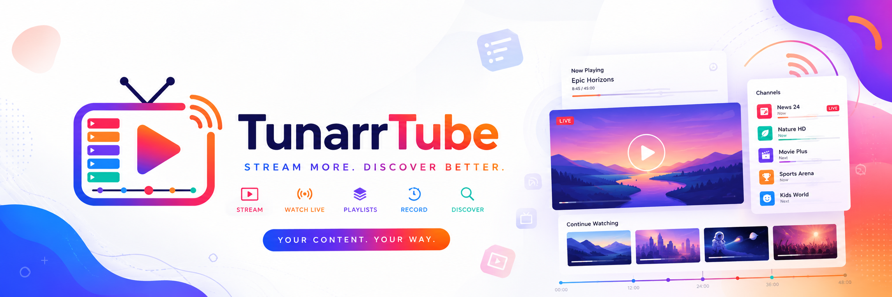

# TunarrTube



Turn public YouTube videos, playlists, and channels into a local media library and publish them as live-TV-style channels in [Tunarr](https://tunarr.com).

TunarrTube is a self-hosted, local-first companion for Tunarr. It discovers videos with `yt-dlp`, stores its catalog in SQLite, downloads or streams media according to each source's retention policy, and keeps linked Tunarr channels up to date.

> [!IMPORTANT]
> TunarrTube is pre-1.0 software for one trusted operator. It has no login system. Keep it on localhost or behind an authenticated reverse proxy or VPN; do not expose it directly to the internet or an untrusted LAN.

## Features

- Import a public YouTube video, playlist, or channel.
- Select channel feeds: Videos, Shorts, archived Live streams, or all feeds.
- Preserve playlist order and detect additions or removals during manual or scheduled syncs.
- Choose permanent downloads, cache-on-first-play, or stream-on-demand per source.
- Produce stable MP4 files with JSON and NFO metadata sidecars.
- Create or update Tunarr Local Media sources and channels.
- Translate media paths when TunarrTube and Tunarr use different host or container paths.
- Monitor background work, cache usage, and sanitized logs from the web interface.
- Recover interrupted jobs after a restart without deleting previously completed media.
- Run natively on macOS, Linux, or Windows, or use the included Docker configuration.

## How it works

```text
YouTube URL
    │
    ▼
yt-dlp analysis ──► SQLite catalog ──► background job queue
                                            │
                          ┌─────────────────┼─────────────────┐
                          ▼                 ▼                 ▼
                    MP4 + sidecars     local cache      live stream
                          │
                          ▼
                  Tunarr Local Media ──► Tunarr channel
```

TunarrTube does not upload video metadata directly into Tunarr. Tunarr scans the shared media directory and reads the generated `<youtubeId>.nfo` sidecars. It then matches scanned programs back to TunarrTube records using the YouTube ID in each filename.

## Quick start with Docker

Docker is the simplest option. The TunarrTube image includes Node.js, `yt-dlp`, and FFmpeg.

### TunarrTube and Tunarr together

```bash
docker compose --profile tunarr up -d --build
```

Open:

- TunarrTube: [http://localhost:3000](http://localhost:3000)
- Tunarr: [http://localhost:8000](http://localhost:8000)

The included stack shares `/media` between both containers and configures TunarrTube to reach Tunarr at `http://tunarr:8000`.

### TunarrTube with an existing Tunarr installation

Create `.env` beside `compose.yaml`:

```dotenv
TUNARRTUBE_TUNARR_URL=http://host.docker.internal:8000
```

Then start only TunarrTube:

```bash
docker compose up -d --build
```

`host.docker.internal` works with Docker Desktop and is configured through `host-gateway` for Linux. If Tunarr is in another Docker stack, connect both services to a shared Docker network and use Tunarr's service name instead.

### Docker storage

The supplied Compose file persists:

| Data | Container path | Default volume |
|---|---|---|
| SQLite database and thumbnails | `/config` | `ytarr-config` |
| Downloaded and cached media | `/media` | `ytarr-media` |
| Optional Tunarr configuration | `/config/tunarr` | `tunarr-config` |

The `ytarr-*` volume names and `/config/ytarr.db` filename are legacy identifiers intentionally retained so upgrades continue using existing data.

To make downloaded files directly visible on the host, replace the `ytarr-media:/media` mounts in `compose.yaml` with the same bind mount for both services, for example:

- Linux/macOS: `/srv/tunarrtube-media:/media`
- Windows Docker Desktop: `D:/TunarrTube:/media`

TunarrTube needs write access; Tunarr only needs read access. The TunarrTube container runs as UID/GID `1001`.

## Native installation

### Requirements

- Node.js 22 or newer
- A current `yt-dlp`
- FFmpeg
- A reachable [Tunarr installation](https://tunarr.com/getting-started/installation/) for channel publishing

### Install dependencies

On macOS:

```bash
brew install yt-dlp ffmpeg
```

On Linux, install FFmpeg using your distribution package manager. Install a current `yt-dlp` using its [official installation instructions](https://github.com/yt-dlp/yt-dlp/wiki/Installation); distribution packages can lag behind YouTube changes.

On Windows, install Node.js 22, [yt-dlp](https://github.com/yt-dlp/yt-dlp/wiki/Installation), and an [FFmpeg Windows build](https://ffmpeg.org/download.html). Add `yt-dlp.exe` and the FFmpeg `bin` directory to `PATH`, open a new PowerShell window, and verify:

```powershell
node --version
yt-dlp --version
ffmpeg -version
```

If either binary is outside `PATH`, configure its absolute path in `.env`:

```dotenv
TUNARRTUBE_YTDLP_PATH="/absolute/path/to/yt-dlp"
TUNARRTUBE_FFMPEG_PATH="/absolute/path/to/ffmpeg"
```

### Start TunarrTube

```bash
npm install
npm run dev
```

Open [http://localhost:3000](http://localhost:3000). For a production build:

```bash
npm run build
npm start
```

Both development and production startup generate Prisma Client and apply committed SQLite migrations automatically. `npm start` listens on `127.0.0.1`; `npm run start:lan` deliberately listens on all interfaces and should only be used behind an authenticated boundary.

## Connect to Tunarr

Two connections are required:

1. TunarrTube must be able to reach Tunarr's HTTP API.
2. Tunarr must be able to read the media files created by TunarrTube.

Use this matrix to choose the URL and media setup:

| TunarrTube | Tunarr | Tunarr URL from TunarrTube | Media setup |
|---|---|---|---|
| Native | Native | `http://127.0.0.1:8000` | Use the same absolute media directory in both applications. |
| Native | Docker | `http://127.0.0.1:8000` | Bind-mount the native media directory into Tunarr and add a path mapping if its container path differs. |
| Docker | Native | `http://host.docker.internal:8000` | Bind-mount host media at `/media`; map `/media` to the native path Tunarr sees. |
| Docker | Docker, included stack | `http://tunarr:8000` | Both containers use the shared `/media` volume; no mapping is needed. |
| Docker | Docker, separate stacks | Shared-network service URL or `http://host.docker.internal:<port>` | Give both containers the same volume or bind mount; map paths if mount points differ. |

Configure the URL under **Settings → Tunarr**, then select **Test Tunarr**. Before changing anything, TunarrTube reads `/openapi.json` and verifies that the connected Tunarr version exposes the required API capabilities.

### Path mapping examples

Add an ordered TunarrTube → Tunarr mapping in Settings when the same files have different absolute paths:

| TunarrTube sees | Tunarr sees |
|---|---|
| `/media` | `/data/youtube` |
| `/srv/tunarrtube` | `/media` |
| `/media` | `D:\Tunarr Media` |

Mappings use longest-prefix matching. Leave them empty when both applications see the same absolute path.

## First channel

1. Open **Sources → Add Source**.
2. Paste a public HTTPS YouTube video, playlist, or channel URL.
3. Analyze it, choose the feed and playback mode, and create the source.
4. Wait for at least one download to complete. Permanent-download sources queue all discovered videos automatically.
5. Open the source's **Tunarr integration** panel.
6. Choose a channel name, optional channel number, and programming order.
7. Select **Create Tunarr Channel**.

Publishing creates or reuses a Local Media source for the directory, waits for Tunarr's scan, and creates the channel lineup. Publishing again updates the linked channel instead of creating a duplicate.

## Playback and retention

| Mode | Initial behavior | On browser playback | When publishing to Tunarr |
|---|---|---|---|
| Permanent download | Queues every discovered video | Plays the local file | Uses the existing local file |
| Cache on first play | Stores metadata only | Downloads into the shared cache | Materializes permanent local files first |
| Stream on demand | Stores metadata only | Proxies a short-lived YouTube stream | Materializes permanent local files first |

Cache limits default to 20 GB and 30 idle days and can be changed in Settings. Pinned, actively playing, and Tunarr-linked assets are protected from eviction.

> **A Tunarr channel never plays a live YouTube stream, regardless of playback mode.** Tunarr's local-media scanner only reads real files sitting in a directory it's watching — it has no way to accept a remote URL per program, and the short-lived signed CDN URL TunarrTube resolves for `stream` playback expires far too quickly to serve a channel that might replay that item hours or days later. So publishing a Cache or Stream source still fully downloads (materializes) every video into the source's directory first, exactly like Permanent download — the playback mode only changes *when* and *how long* that copy is retained outside of Tunarr publishing, not whether Tunarr channels stream live. Live, on-demand streaming without ever writing a file only happens in TunarrTube's own in-app preview player, never in a published Tunarr channel.

Manual or scheduled synchronization detects new videos and marks missing memberships without deleting previously completed downloads. Channel sources can limit how much recent history is inspected. Run only one TunarrTube process against a given SQLite database; the worker and scheduler are intentionally single-instance.

## Configuration

Copy `.env.example` to `.env` only when you need overrides. Environment settings seed the application on its first start; afterward, change the media directory and Tunarr URL in the Settings page.

| Variable | Purpose | Default |
|---|---|---|
| `DATABASE_URL` | Prisma SQLite connection | `file:./ytarr.db` |
| `TUNARRTUBE_YTDLP_PATH` | Absolute `yt-dlp` executable path | Auto-discovered |
| `TUNARRTUBE_FFMPEG_PATH` | Absolute FFmpeg executable path | Auto-discovered |
| `TUNARRTUBE_MEDIA_DIR` | Initial media root | `storage/media` |
| `TUNARRTUBE_THUMBNAIL_DIR` | Thumbnail storage root | `storage/thumbnails` |
| `TUNARRTUBE_TUNARR_URL` | Initial Tunarr base URL | `http://127.0.0.1:8000` native; `http://tunarr:8000` in Compose |
| `TUNARRTUBE_PORT` | Docker host port | `3000` |
| `TUNARR_PORT` | Optional Tunarr Docker host port | `8000` |
| `TUNARR_IMAGE` | Optional Tunarr image tag or digest | `chrisbenincasa/tunarr:latest` |
| `TZ` | Container timezone | `UTC` |

Former `YTARR_*` variables remain supported as lower-priority aliases for existing installations.

Native defaults:

- Database: `prisma/ytarr.db`
- Media: `storage/media/`
- Thumbnails: `storage/thumbnails/`
- Source files: `<media-root>/<source-directory>/<youtubeId>.mp4`
- Metadata: matching `<youtubeId>.json` and `<youtubeId>.nfo` files

Back up the SQLite database and media root before upgrades.

## Operations

- **Queue** shows running, queued, retrying, and recently completed background work. A queued job (including one waiting to retry) can be cancelled outright or postponed to a later time (15 minutes up to a week) without losing its place; a failed or cancelled one can be retried, which requeues it fresh rather than resuming the old attempt. A running download, cache, sync, metadata, or Tunarr publish/refresh job can be stopped mid-flight — it's killed and lands in the same cancelled state as a queued cancellation; a metadata-repair or thumbnail job has no interrupt point and finishes on its own instead. Cancelling or stopping a download or cache job is sticky — it stays cancelled through automatic syncs and Tunarr refreshes until you retry it (or play the video again, for Cache/Stream sources) or switch the source's playback mode to Permanent, which re-downloads everything not yet complete. The toolbar's Pause queue toggle stops the worker from picking up any new job (existing running work keeps going until it finishes or you stop it) — use it and Resume queue to hold everything for a while.
- **Cache** shows used, pinned, protected, and evictable storage.
- **Logs** contains sanitized operational events. Signed YouTube/Googlevideo URLs and cookie flags are redacted before persistence.
- **Settings** tests binary discovery and Tunarr connectivity, controls cache limits, repairs older metadata sidecars, and previews path mappings.

Downloads are written to temporary paths and renamed into place only after `yt-dlp` and FFmpeg succeed. Interrupted jobs are requeued after restart and normally retry up to three times.

## Troubleshooting

### `yt-dlp` or FFmpeg is not found

Open Settings to inspect the detected paths and versions. Add `TUNARRTUBE_YTDLP_PATH` or `TUNARRTUBE_FFMPEG_PATH` to `.env` if automatic discovery fails, then restart TunarrTube.

### A YouTube URL cannot be analyzed

Only public HTTPS URLs on supported YouTube hosts are accepted, including `youtu.be`. Cookie-based access, private/account-only media, and age-restricted authentication are not supported.

YouTube changes its extraction behavior regularly. Update `yt-dlp`, restart TunarrTube, and use **Sync Now**. An existing empty source does not need to be recreated.

### A download failed

Review **Logs** for the sanitized error. Check available disk space, filesystem permissions, and the installed `yt-dlp`/FFmpeg versions, then queue the video again.

### Tunarr cannot find downloaded videos

- Confirm at least one video is fully downloaded.
- Confirm Tunarr can read the same media directory.
- Add a path mapping if the absolute paths differ.
- Remember that `127.0.0.1` inside a container refers to that container, not its host.
- Run **Repair video metadata** if older files display their YouTube ID instead of their title.

### A Tunarr channel or media source was recreated

Use **Reconcile** in the source's Tunarr integration panel to repair local links. **Unlink** only forgets TunarrTube's link; it does not delete the remote Tunarr objects.

### Deleting a source does not remove its Tunarr channel or files

Removing a source only removes its TunarrTube catalog entry. The source's media directory is left on disk, and TunarrTube never calls the Tunarr API to delete remote objects — any Tunarr channel or Local Media source built from that directory keeps existing in Tunarr, now orphaned from TunarrTube's perspective. Delete the channel in Tunarr yourself, and remove the files from the media directory yourself, if you want them gone too.

## FAQ

**If I delete a source that was published as a Tunarr channel, does that remove the channel or the downloaded media?**
No. Source deletion only removes TunarrTube's own catalog rows for that source. It preserves the source's media directory on disk and never calls the Tunarr API, so any linked Tunarr channel and Local Media source keep existing in Tunarr, unlinked from TunarrTube. Delete the channel in Tunarr and the files on disk yourself if you want them gone too.

**Does TunarrTube ever delete a video because it disappeared from YouTube?**
No. A sync only marks the corresponding membership `missing`; it never deletes the video's metadata or an already-downloaded file.

**Can I run more than one TunarrTube instance against the same database?**
No. The background job worker and scheduler keep their state in-process with no distributed locking, so only a single running instance is supported per SQLite database.

**Does TunarrTube support private, unlisted, or age-restricted videos?**
No. Only public HTTPS URLs on supported YouTube hosts are accepted. Cookie-based or authenticated extraction is intentionally out of scope.

**If I change the media directory in Settings, does it move my existing downloads?**
No. Only future downloads use the new directory; already-completed files keep their recorded paths and are not moved.

**Can a Tunarr channel stream a video directly from YouTube, without TunarrTube downloading it?**
No, for any playback mode. Tunarr's local-media source only scans real files on disk, and the signed YouTube CDN URL TunarrTube resolves for on-demand streaming is short-lived — it can't be handed to Tunarr once and replayed later on a channel's schedule. Publishing a Cache or Stream source to Tunarr therefore materializes (fully downloads) every video first, the same as Permanent download; the playback mode only affects retention outside of Tunarr, not whether a Tunarr channel streams live. This is a limitation of Tunarr's local-media scanner, not a TunarrTube setting — it would need Tunarr to support a remote/URL-backed media source to change.

## Security

TunarrTube's API can start downloads, change writable paths, and mutate the configured Tunarr server. The default native and Compose configurations bind to host loopback only. If remote access is required, use an authenticating reverse proxy or VPN with TLS and access controls.

See [SECURITY.md](SECURITY.md) for the supported-version policy, deployment guidance, and private vulnerability-reporting process.

## Development

```bash
npm install
npm test
npm run typecheck
npm run build
```

Use `npm run test:watch` during development and `npm run db:migrate` after editing `prisma/schema.prisma`. Commit generated migrations with schema changes.

Architecture and product context live in:

- [Release notes](RELEASE_NOTES.md)
- [Product overview](docs/PRODUCT.md)
- [Architecture](docs/ARCHITECTURE.md)
- [Engineering decisions](docs/DECISIONS.md)
- [Contributing guide](CONTRIBUTING.md)
- [Code of Conduct](CODE_OF_CONDUCT.md)

## Support

If TunarrTube is useful to you, consider supporting its development:

- [GitHub Sponsors](https://github.com/sponsors/acroix2020)
- [Ko-fi](https://ko-fi.com/augustosc)
- [Buy Me a Coffee](https://buymeacoffee.com/augustosc)

## License and disclaimer

TunarrTube is available under the [MIT License](LICENSE).

TunarrTube is not affiliated with or endorsed by YouTube or Tunarr. You are responsible for ensuring that downloading or streaming media complies with applicable law, the source platform's terms, and the rights of content owners. The MIT license covers TunarrTube's source code, not downloaded media.
